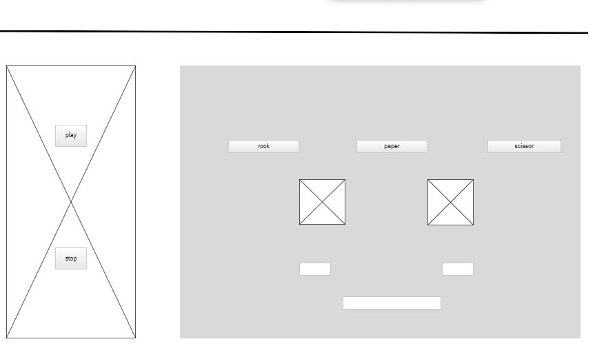

# RPS-Victim
[Rock paper scissors victim](https://pages.git.generalassemb.ly/xlightx/RPS-Victim/)

Super junior is a global music band and they making life decisions by playing rock paper scissors ,and the loser will do anything for the rest members maybe cleaning or carry them on his back  , sometimes they cross the lines and they make the loser wear strange clothes at the airport , There is only one victim in this game, Eunhyuk
So I create this game to help my Eunhyuk to win .

## Technologies
- HTML & CSS.
- JavaScribt , Dom and jQuery
## Wireframes
- Sketching.
- Just in mind application.

## User stories
- As a user I want stop music button , so that I can stop music when I want.
- AS a user I want Home button  , so that I can back home from black history page .
- As a user I want to see my score , so that I will know how many times I win.
- As a user I want sounds effects in the game , so that I will enjoy the game.

## Plan
- Wireframing
- Webpage structure and style
- Logic design
- Coding 
### Development process
The difficult part is desing logic I change it even during coding process ,
 I'm stuck many times so I solve these problems by asking the instructor and  use google and  youtube.

 ## unsolved problems
 - During coding this game I discovered that I don't know how to use many functions and use it together so that I repeat the code .
 - In my design there are two images that I want to change is according to the player and computer choice.
 - I try to make alert after win and lose .
 - The black history page supposed to be hidden and appear in pop alert when user lose.
 ## Winner solved
 If statment and repeating code

 ##  Favorite function 
 Computer random choice it's simple function work on array and math object
